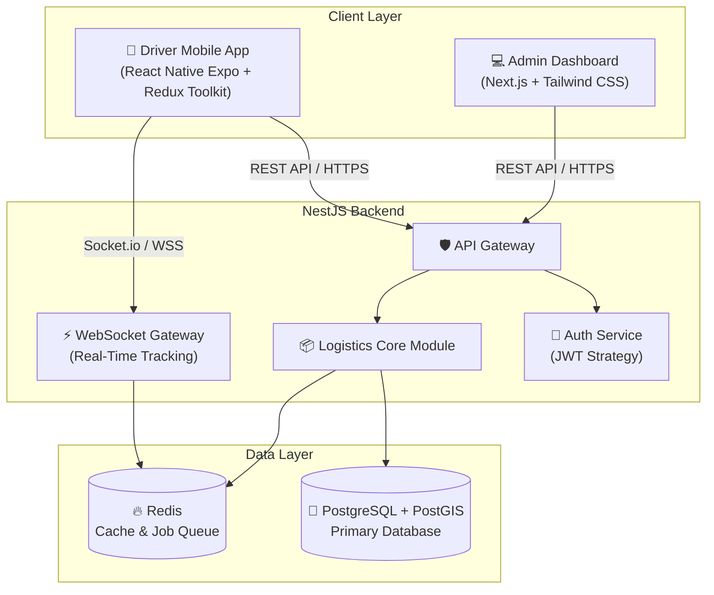

# LogiTrack — Technical Architecture

## 1. System Overview

LogiTrack is a real-time fleet management platform that handles data flow between field drivers and the operations center. It consists of three layers:



---

## 2. Technology Stack

### Backend
- **Framework:** NestJS (modular architecture)
- **Validation:** `class-validator` + `class-transformer`
- **Job Queue:** BullMQ (Redis-backed) — async processing for location data and file uploads
- **WebSockets:** Socket.io via NestJS Gateway — live driver tracking
- **MQTT:** Eclipse Mosquitto broker — IoT telemetry pipeline

### Mobile App (Driver)
- **Framework:** React Native (Expo managed workflow)
- **State Management:** Redux Toolkit (RTK) + RTK Query
- **Local Storage:** `@react-native-async-storage/async-storage`
- **Maps:** `react-native-maps` (Google Maps / Apple Maps native)
- **Background Tasks:** `expo-task-manager` + `expo-background-fetch`

### Admin Dashboard
- **Framework:** Next.js 16 (App Router)
- **Styling:** Tailwind CSS + Radix UI + shadcn/ui
- **Charts:** Recharts
- **Maps:** React Leaflet + Google Maps API

### Database
- **PostgreSQL + PostGIS:** Relational data and geo-spatial queries
- **Redis:** Live location cache and job queues

---

## 3. Database Schema

Core entities and relationships:

```
User ──< DriverProfile ──< LocationLog
               │
               ├──< Shipment ──< DeliveryProof
               │
               └── Vehicle

User ──< SupportTicket ──< SupportMessage
User ──< Message (sender / recipient)
Company ──< Invoice ──< Shipment
Geofence ──< GeofenceEvent
DriverProfile ── DriverScore
```

### Key Tables

| Table | Description |
|---|---|
| `users` | All users (ADMIN, DISPATCHER, DRIVER, COMPANY_OWNER) |
| `driver_profiles` | Driver info, live location, availability |
| `vehicles` | Vehicle inventory and specs |
| `shipments` | Shipment lifecycle with PostGIS coordinates |
| `delivery_proofs` | Photo + signature delivery confirmation |
| `support_tickets` | Driver-to-admin support workflow |
| `support_messages` | Ticket conversation messages |
| `messages` | Direct admin–driver messaging |
| `location_logs` | GPS history (high-volume telemetry) |
| `geofences` | Geographic boundary definitions |
| `geofence_events` | Entry/exit events per driver |
| `driver_scores` | Performance metrics |
| `invoices` | Billing records per company |
| `audit_logs` | System-wide action log |

---

## 4. Scalability Roadmap

Planned improvements beyond the current implementation:

1. **Storage:** Migrate from `AsyncStorage` to `react-native-mmkv` for faster local I/O
2. **Offline DB:** `WatermelonDB` for managing thousands of records locally
3. **Real-Time:** Socket.io connection pooling and namespace optimization
4. **Observability:** Sentry + structured Winston logs already in place; extend with Prometheus metrics
