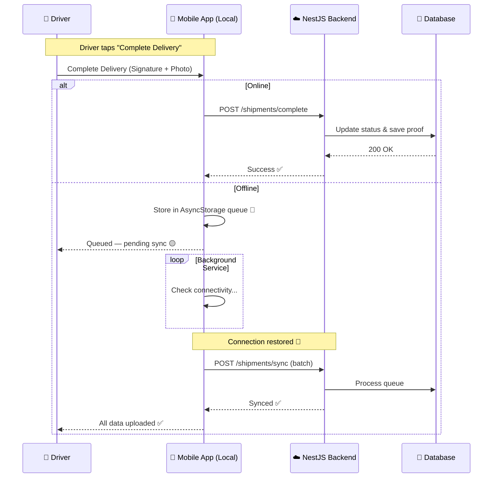

# LogiTrack — Key Workflows

## Workflow 1: Offline-First Delivery Sync

Ensures operations continue even when the driver loses internet connectivity.



---

## Workflow 2: Battery-Efficient Live Tracking

Adaptive GPS ping frequency based on driver movement:

| State | Condition | GPS Interval |
|---|---|---|
| Stationary | Speed < 5 km/h | Every 5 minutes |
| Moving | Speed > 20 km/h | Every 10 seconds |

**Data flow:** GPS coordinates → Socket.io / MQTT → Redis cache → Admin dashboard (live map)

The backend caches the latest position in Redis for instant map rendering. Historical data is persisted asynchronously to `location_logs` via BullMQ.

---

## Workflow 3: Support Ticket Lifecycle

Driver-to-admin support flow with real-time messaging:

```
Driver opens ticket
       │
       ▼
  [OPEN] ──► Admin assigns ──► [ASSIGNED]
                                    │
                              Admin responds
                                    │
                                    ▼
                             [IN_PROGRESS]
                                    │
                          Issue resolved / closed
                                    │
                              [RESOLVED] ──► [CLOSED]
```

- All messages delivered in real-time via WebSocket to both admin and driver
- Priority levels: LOW / NORMAL / HIGH / URGENT
- Admin replies trigger a `fetchMyTicket()` refresh on the driver's device

---

## Workflow 4: OTA (Over-The-Air) Updates

Critical bug fixes delivered without app store submission:

1. Developer runs `eas update` to publish a new JS bundle
2. Driver opens the app — update downloads silently in the background
3. On next launch, the updated bundle runs automatically

This enables zero-downtime hotfixes for the driver fleet.

---

## Workflow 5: Geofence Event Detection

1. Driver's location is streamed via MQTT/WebSocket
2. Backend compares position against active `Geofence` records using PostGIS
3. On ENTER or EXIT event: record saved to `geofence_events`, push notification sent, admin alerted in real time
